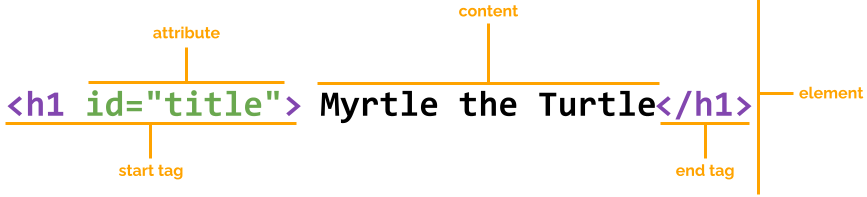

The `figure` element is similar to a `div` in that its going to help give us some more structure on our page. The `figure` tag is used in HTML to group together content like an image, diagram, or code snippet with its caption. It helps keep things organised so the picture and its description always stay connected on the page.

For now, let's go through and add the `figure` tag around each of our image/quotes to pop them in boxes.

While we are here we're going to add the class of *tile* to each figure box. 

Up until now, most of the elements we've used have contained a tag name and some content. But elements can also have what we call **attributes**. Attributes allow us to define more information about the element.

We do this by adding the `attribute` to the opening tag and providing a `value` inside of quotes.

For example, the following is an `h1` element with an `id` attribute of value `title`:



Typically we would use an `id` if we wanted to identify one object for styling purposes, and we would use a `class` attribute if we wanted to apply the same styling to multiple things on our page.

Let's add this opening and closing figure tag to each box on our page. 

```html
<figure class="tile">
<!-- your images or paragraph text -->
</figure>

Your `main` should now look lke the below.

```html

<main>
      <h2>2025</h2>
      <div>
        <figure class="tile">
            <a href="https://en.wikipedia.org/wiki/Turtle" target="_blank"> 
            
        </a>
        </figure>

        <figure class="tile">
        
        </figure>

        <figure class="tile">
        
        </figure>
        
        <figure class="tile">
        
        </figure>

        <figure class="tile">
        
        </figure>

        <figure class="tile">
            <div>
            <p>“Creativity takes courage.”</p>
            </div>
        </figure>

      </div>  
    </main>
```

Did you notice how your images straightened up a bit after we added that last bit of code? This is because we've already added some CSS styling in to get you started. We love it when a plan comes together! 

Next we're going to add a couple of final styling attributes. Firstly we want to target that `div` that is wrapped around all our content and give it the class `alltiles`. This is going to group them up so they start appearing in the rows and columns we've defined in our CSS (don't worry we will explore that magic shortly). Find the div and add in the class *alltites* as shown below.

```html
<div class = "alltiles">
```

And lastly we are going to add a class to our `<div>` with the quote in it to style it separately from the other tiles. For this one we will use an `id`. Go ahead and find that div, and add in the below ID.

```html
<div id = "quotetile">
```

Yeehawww we've got 6 boxes looking cute!

## Final step - Captions!

The last step we are going to do is adding some cute little captions to our figures. We're going to use the element `figcaption` for this. 

```html

<figcaption>Inspiration</figcaption>

```

Let's go ahead and pop those underneath each of our images. You don't need to put one on your quote box, but if you'd like to call to - go for it! The full code is below if you want to check your work.

## Check your Code

```html 

<head>
    <meta charset="UTF-8">
    <title>She Codes</title>
    <link rel="stylesheet" href="./styles.css">
</head>

<body>
    <!-- Your content goes here -->
    <header>
        <h1>Mood Board</h1>
        <p>A place for inspiration and creativity</p>
    </header>

    <main>
      <h2>2025</h2>
      <div class = "alltiles">
        <figure class="tile">
            <a href="https://en.wikipedia.org/wiki/Turtle" target="_blank"> 
                
            </a>
            <figcaption>Inspiration</figcaption>
        </figure>

        <figure class="tile">
        
            <figcaption>Motivation</figcaption>
        </figure>

        <figure class="tile">
            
            <figcaption>Happiness</figcaption>
        </figure>

        <figure class="tile">
            
            <figcaption>Favourite Colour</figcaption>
        </figure>

        <figure class="tile">
            
            <figcaption>Dream Holiday Location</figcaption>
        </figure>

        <figure class="tile">
            <div id = "quotetile">
            <p>“Creativity takes courage.”</p>
            </div>
        </figure>
        </div>
      </div>  
    </main>

    <footer>
        <p>Created with ❤️ by Your Name</p>
    </footer>

</body>

</html>
```