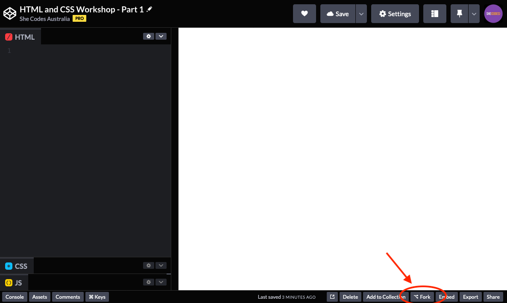
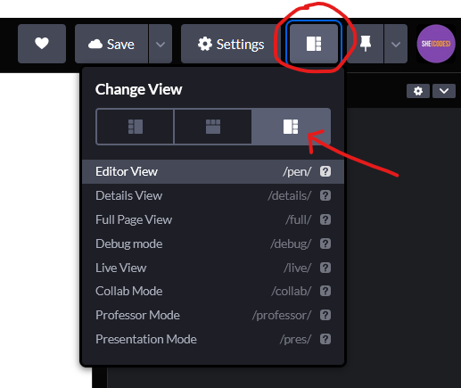

We've created a template for you to get started with.
Open the template by [clicking this link](https://codepen.io/shecodesaus/pen/NWwjQrr?editors=1000).

Once you've opened the pen, click the `fork` button on the bottom right of the page (you will need to make sure you are logged in first).

This will make a copy of the pen under your account.
This means that you can edit it as much as you like and keep your changes.

{}

You can change the layout of the codepen editor by clicking the view button in the top left (see the screenshot below).

{}

Let's understand the different parts of CodePen before we get started with our code.
Take a look at the screenshot below:

In this screenshot, we can see:
- The large white space on the left is our webpage. This is where we will see the result of our code.
- There are three editors on the right. These are for writing:
    - HTML
    - CSS
    - JavaScript. We won't be using JavaScript in this tutorial so you can go ahead and minimise this editor if it is open.
